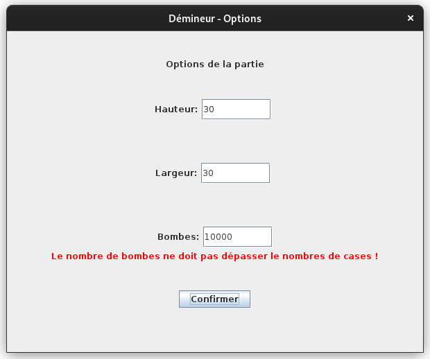
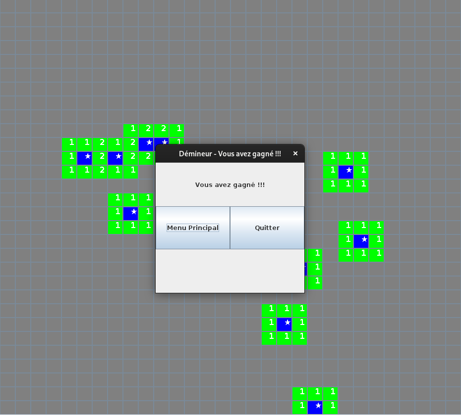

# Rapport SAÉ: DÉMINEUR

# Membres

- Yvan FOUCHER (Groupe 5)

# Résumé du projet

Le but du projet est de coder le célèbre jeu du démineur en Java en ajoutant la possibilité de sauvegarder sa partie. 

# Fonctionnalités du programme

## Un magnifique menu

Au lancement du jeu, le joueur peut choisir de créer une nouvelle partie ou d'en charger une sauvegardée.


## Paramètres de la partie

Après avoir choisit de créer une nouvelle partie, le joueur peut choisir le nombres de carreaux en hauteur, en largeur et le nombre de bombes sur la grille.

Un petit message d'erreur peut ~~l'insulter~~ le prévenir s'il a fait une erreur dans un des champs (comme par exemple: nombre de lignes, colonnes trop petit, ou bien le nombre trop élévé de bombes).



## En partie

Le joueur peut réveler une case en faisant un clic droit. Il peut aussi choisir une case où il va pouvoir placer un drapeaux là où il pense qu'il y a une bombe. Il peut aussi marquer une case avec un `?` s'il a un doute pendant la partie.

Le joueur peut sauvegarder et quitter la partie en plein milieu s'il le désire. La partie pourra être rechargée au prochain lancement du jeu.

## Victoire (ou défaite)

En cas de victoire un magnifique écran vient proposer au joueur de relancer une partie ou de quitter le jeu. 

Le joueur peut tout de même contempler la grille en déplaçant le message.



# Structure du programme

Le programme est reparti en plusieurs classes qui permettent d'effectuer les différentes actions tout au long d'une partie.

## Diagramme de classe

# Sauvegarde

Le fonctionnement de la sauvegarde est plutôt simple. 

Les informations de la grille sont stockées en entiers dans le fichier `sauv.dat`.

Tout d'abord dans le fichier, on vient commencer par stocker le nombre de lignes (hauteur), le nombre de colonnes (largeur), puis le nombre de bombes posées. Ce qui donnerait en décimal pour une grille de 12x12 avec 20 bombes.

```
12
12
20
```

Ensuite on vient parcourir le tableau avec une boucle en enregistrant dans le fichier pour chaque cases, les valeurs suivantes:

### Bombe

| Valeur | Description                 |
| ------ | --------------------------- |
| 1      | La case est une bombe       |
| 0      | La case n'est pas une bombe |

### Révélée

| Valeur | Description                 |
| ------ | --------------------------- |
| 1      | La case est révelée         |
| 0      | La case n'a pas été révélée |

### L'état de la case

| Valeur | Description                                     |
| ------ | ----------------------------------------------- |
| 0      | Le joueur n'a pas effectué d'action sur la case |
| 1      | Le joueur a signalé une bombe sur la case       |
| 2      | Le joueur a un doute sur la case                |

### Voisins

Ensuite on vient stocké le nombre de bombes voisines que la case possède. 

## Exemple de valeurs décimales

```
1
0
1
4
```

La case est une bombe, elle n'a pas été révélée mais le joueur a émis un doute sur cette case. La case est entourée par 4 bombes.

# Algorithme qui permet de révéler plusieurs cases

Lorsqu'une case ne contient pas de numéro et n'est pas une bombe, vient être cliquée par le joueur, le jeu révèle toutes les cases vides alentours ainsi que les cases numérotées. 

# Conclusion personnelle

J'ai bien aimé ce projet car c'est un jeu que j'affectionne particulièrement pendant les heures de projet à l'IUT (quand on a pas de projets bien sûr).  La partie algorithmique m'a bien plu sur ce projet. 
Je m'étais lancé un défi pour voir en combien de temps je pouvais faire ce projet et en 13 heures la plus grande partie du projet était faite. En 20 heures le projet a pu être fini entièrement jusqu'à la sauvegarde des parties.

# Idées d'améliorations

Une amélioration possible serait de découper les différentes parties dans plusieurs sous-répertoires pour permettre une meilleure lisibilité.
